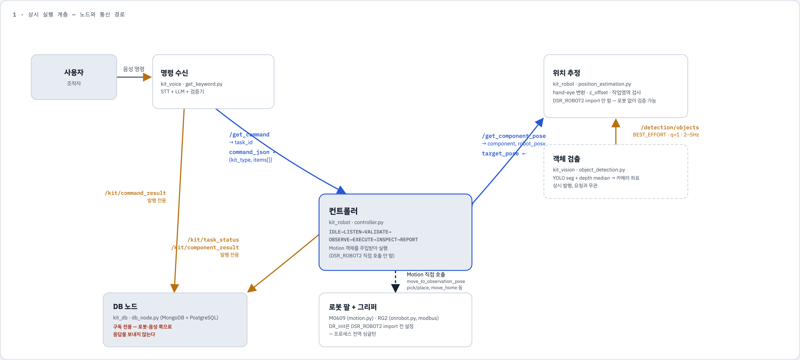
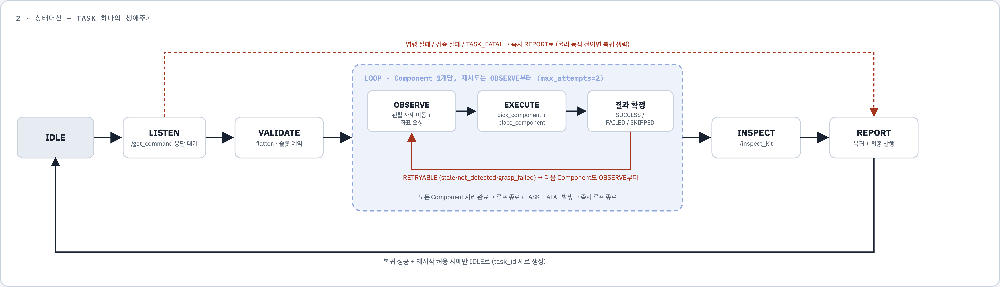

# 음성·비전 기반 재난 구조키트 자동 구성 시스템
<p align="center">
  
  
  
  
  
  
</p>

<p align="center">
  
  
</p>

사용자의 음성 명령을 해석하고 RGB-D 영상에서 물품을 인식하여 **Doosan M0609 협동로봇과 OnRobot RG2 그리퍼로 구조키트를 구성하는 ROS 2 프로젝트**입니다.

웨이크워드 감지, STT·LLM 명령 해석, YOLO Segmentation, 좌표 변환, MoveIt 2 경로 계획, 파지·배치, 구성품 검사와 결과 저장을 연결합니다. Vision–Language–Action 모듈을 ROS2로 통합한 구조입니다.


## 주요 기능

- **음성 작업 지시:**
  - `hello rokey` 웨이크워드 감지 후 Whisper STT와 GPT-4o로 명령을 구조화하고 지원 품목·수량을 검증합니다.
      
- **객체 탐지:**
  - YOLO26s-seg 모델 기반 객체 탐지와 클래스·마스크·중심점을 얻습니다.
  - mask 내부 유효 depth의 중위값으로 카메라 기준 3D 좌표를 계산합니다.
      
  
- **품목 파지:**
  - mesh가 없는 경우
    - Hand–Eye 보정 행렬과 로봇 자세로 3D 좌표를 변환하고 offset 거리만큼 접근하여 파지를 진행합니다.
      
  - mesh가 있는 경우  
    - FoundationPose를 사용하여 객체와 mesh를 정렬하여 포즈를 찾습니다.  
    - GraspGenX를 사용하여 객체의 현재 포즈에 따른 5개의 후보 파지 형태를 생성합니다.  
    - Gripper 후보의 기울기·점수·접근 및 후퇴 경로를 검증하여 파지를 진행합니다.
        
  
- **충돌 환경 구성:**  
  - 초기 관측 구간에서 필터링한 PointCloud로 정적 OctoMap을 생성하고 재사용합니다.  
  - 작업 공간을 별도 keepout box로 설정합니다.
      
  
- **작업 관리:**  
  - 명령 수신, 객체 관찰, 작업 실행, 결과 검사 및 보고를 상태머신으로 제어합니다.
      
  
- **이력·재고 관리:**  
  - MongoDB에 명령과 실행 결과를 기록합니다.  
  - PostgreSQL에서 품목과 재고를 관리합니다.
      
  
## 시스템 구성  
  


일반 품목은 YOLO 기반 좌표 추정을 사용하고, 컵라면은 외부 FoundationPose·GraspGenX 파이프라인의 후보를 사용합니다. 실패 유형에 따라 재관찰·재시도하거나 작업을 종료합니다.

<details>
<summary><strong>작업 상태 흐름 보기</strong></summary>



</details>  
  
## 기술 스택
  
| 구분 | 구성 |
| --- | --- |
| OS / 미들웨어 | Ubuntu 24.04 / ROS 2 Jazzy |
| 로봇 / 그리퍼 | Doosan M0609 / OnRobot RG2 |
| 카메라 | RealSense RGB-D, 컬러 정렬 depth 및 PointCloud2 |
| 비전 | Ultralytics YOLO Segmentation, PyTorch, OpenCV |
| 음성 / 언어 | openWakeWord, Whisper API, GPT-4o, LangChain |
| 로봇 계획 | MoveIt 2, OMPL, RRTConnect, KDL IK |
| 장애물 표현 | OctoMap, Planning Scene collision object |
| 데이터베이스 | PostgreSQL 16 / MongoDB 7 |
| 컨테이너 | Docker Compose, NVIDIA GPU 기반 비전 추론 |
  
카메라·로봇·음성·좌표 추정·DB 노드는 호스트에서 실행하고, YOLO 추론과 DB 서버는 Compose로 실행하는 구성을 제공합니다. 컵라면 인식에는 FoundationPose와 GraspGenX 환경이 별도로 필요합니다.
  
## 지원 품목 및 레시피
  
| 클래스 ID | 품목 |
| ---: | --- |
| 0 | 마스크 |
| 1 | 분유 |
| 2 | 샴푸리필 |
| 3 | 수세미 |
| 4 | 양갱 |
| 5 | 여행용티슈 |
| 6 | 일회용숟가락 |
| 7 | 컵라면 |
| 8 | 햄 |

클래스 정의는 [`class_names.json`](src/kit_vision/resource/class_names.json), 음성 레시피는 [`kit_recipes.json`](src/kit_voice/resource/kit_recipes.json)에서 관리합니다.

| 기본 레시피 | 구성 |
| --- | --- |
| 키트1번 | 컵라면, 샴푸리필, 양갱 각 1개 |
| 키트2번 | 여행용티슈, 수세미, 일회용숟가락 각 1개 |

현재 배치 슬롯은 `slot_1`부터 `slot_6`까지 6개입니다.

## 저장소 구성

<details>
<summary><strong>디렉터리별 역할 보기</strong></summary>

| 경로 | 역할 |
| --- | --- |
| `src/kit_voice/` | 웨이크워드, STT, LLM, 명령 서비스 |
| `src/kit_vision/` | RGB-D 구독, YOLO 추론, 검출 및 디버그 영상 |
| `src/kit_robot/` | 상태머신, 좌표 추정, MoveIt 이동, RG2 및 OctoMap 제어 |
| `src/kit_interfaces/` | 공통 ROS 2 메시지와 서비스 정의 |
| `src/kit_db/` | 실행 이벤트 저장 및 재고 반영 |
| `src/API/` | Doosan·OnRobot 드라이버, M0609 bringup·MoveIt 설정 |
| `infra/` | PostgreSQL·MongoDB 초기화 및 운영 문서 |
| `scripts/` | 통합 실행과 비전 디버그 실행 스크립트 |
| `docs/` | 설계, 인터페이스, DB 및 실행 관련 문서 |
| `compose.yaml` | DB 서버와 비전 컨테이너 구성 |

</details>

## 설치 및 준비

### 1. 브랜치 받기

```bash
git clone --branch feature/last --single-branch \
  https://github.com/mi1nn/Project2-ROS2-VLA.git
cd Project2-ROS2-VLA
```

### 2. 의존성 및 빌드

ROS 2 Jazzy, colcon, rosdep, MoveIt 2, RealSense ROS 드라이버, Cyclone DDS, Docker Compose와 NVIDIA Container Toolkit이 필요합니다. 음성 노드에는 `openai`, `langchain-openai`, `python-dotenv`, `sounddevice`, `scipy`, `openwakeword` 및 해당 모델을 실행할 런타임이 필요합니다.

rosdep 초기화와 ROS 설치를 완료한 환경에서 실행합니다.

```bash
source /opt/ros/jazzy/setup.bash
rosdep install --from-paths src --ignore-src -r -y
colcon build --symlink-install
source install/setup.bash
```

현재 Python 의존성이 모두 패키지 메타데이터에 선언된 것은 아니므로, 위 명령만으로 모든 실행 환경이 준비되는 것은 아닙니다. 비전 컨테이너 의존성은 [`Dockerfile`](src/kit_vision/Dockerfile)을 참고하세요.

### 3. 환경 설정

```bash
cp .env.example .env
```

`.env`에서 PostgreSQL·MongoDB 계정과 비밀번호를 설정합니다. 음성 노드를 실행하는 셸에는 `OPENAI_API_KEY`를 설정해야 합니다. 음성 코드는 패키지의 `resource/.env`도 읽습니다. 실제 키와 비밀번호는 Git에 커밋하지 않습니다.

모든 ROS 터미널은 같은 환경을 사용합니다.

```bash
source /opt/ros/jazzy/setup.bash
source install/setup.bash
export ROS_DOMAIN_ID=20
export RMW_IMPLEMENTATION=rmw_cyclonedds_cpp
```

비전 Compose는 호스트의 `~/.config/cyclonedds/cyclonedds.xml`을 마운트합니다. 해당 파일과 현장 네트워크에 맞는 DDS 설정을 먼저 준비합니다.

### 4. 장비별 보정

| 파일 | 확인 항목 |
| --- | --- |
| [`motion.yaml`](src/kit_robot/config/motion.yaml) | 프레임, MoveIt endpoint, 관찰·검사 자세, 슬롯, keepout, OctoMap |
| [`controller.yaml`](src/kit_robot/resource/controller.yaml) | 지원 품목, 슬롯, timeout, 재시도 |
| [`grasp_params.json`](src/kit_robot/resource/grasp_params.json) | 품목별 그리퍼 폭·힘 및 파지 보정 |
| `src/kit_robot/resource/T_gripper2camera.npy` | 실제 카메라 장착 상태의 Hand–Eye 보정 행렬 |

기본 좌표와 보정값은 저장소 개발 환경의 값입니다. 로봇 IP, 카메라 장착, 트레이 위치에 맞게 검증한 뒤 실행합니다.

## 실행 방법

저장소 루트를 기준으로 실행합니다. 아래 장기 실행 명령은 각각 별도 터미널을 사용합니다.

### 1. DB 서버

```bash
docker compose up -d postgres mongodb
docker compose ps
```

### 2. 로봇 및 MoveIt 2

```bash
ros2 launch dsr_moveit_config_m0609 start.launch.py \
  mode:=real name:=dsr01 model:=m0609 gripper:=rg2 \
  host:=192.168.1.100 gui:=true
```

### 3. RealSense

```bash
ros2 run realsense2_camera realsense2_camera_node --ros-args \
  -r __ns:=/ -r __node:=camera \
  -p enable_color:=true -p enable_depth:=true \
  -p depth_module.depth_profile:=848x480x15 \
  -p rgb_camera.color_profile:=1280x720x15 \
  -p align_depth.enable:=true -p enable_rgbd:=true \
  -p enable_sync:=true -p pointcloud.enable:=true \
  -p pointcloud.stream_filter:=2 \
  -p enable_accel:=false -p enable_gyro:=false
```

### 4. 비전 추론

```bash
docker compose up -d --build vision
docker compose logs -f vision
```

모델은 `src/kit_vision/resource/`의 `.pt` 파일을 사용하며 해당 디렉터리에 가중치가 정확히 1개 있어야 합니다. 기본 추론 크기는 `640`, confidence threshold는 `0.5`입니다. 처리 주기의 하한은 `0.3초`이며 실제 검출 주파수는 추론 시간에 따라 달라집니다.

선택적으로 X11 환경에서 디버그 화면을 실행합니다.

```bash
bash scripts/vision-up.sh
```

### 5. 좌표 추정·음성·DB 노드

```bash
ros2 run kit_robot position_estimation
```

```bash
ros2 run kit_voice get_command
```

```bash
set -a
source .env
set +a
ros2 run kit_db db_node
```

### 6. Controller

```bash
ros2 run kit_robot controller --ros-args \
  --params-file src/kit_robot/resource/controller.yaml
```

명령 대기 상태에서 `hello rokey`를 말하고 녹음 안내에 따라 작업을 요청합니다. 예: “키트2번 만들어 줘.”

Ubuntu GUI용 [`e2e-up-ubuntu.sh`](scripts/e2e-up-ubuntu.sh)는 Terminator와 tmux로 실행 화면을 구성합니다. 사전 빌드·환경 설정이 필요하며 실기 로봇 IP가 스크립트에 지정되어 있습니다. 외부 컵라면 인식 서버는 별도로 실행해야 합니다.

## 외부 패키지

컵라면을 포함한 작업은 `/cup_pick/perception` 서비스와 `/tmp/graspgenx_live/latest.npz` 후보 파일을 제공하는 외부 환경이 필요합니다. 이름과 경로는 `motion.yaml`의 `graspgenx_live`에서 설정합니다.

### 1. FoundationPose

#### 1. git clone
```bash
cd ~
git clone https://github.com/NVlabs/FoundationPose.git
cd FoundationPose
```  

#### 2. Pretrained Weights
다음 구조가 되도록 FoundationPose 공식 github에서 weights를 준비합니다.  
https://github.com/NVlabs/FoundationPose
```bash
FoundationPose/
└── weights/
    ├── 2023-10-28-18-33-37/
    │   └── model_best.pth
    │
    └── 2024-01-11-20-02-45/
        └── model_best.pth
```  

#### 3. Custome File
```bash
mkdir -p ~/FoundationPose/models

cp ~/Project2-ROS2-VLA/tools/foundation_pose_worker.py \
   ~/FoundationPose/foundation_pose_worker.py
   
cp ~/Project2-ROS2-VLA/tools/RAMYEON.ply \
   ~/FoundationPose/models/RAMYEON.ply
   
cp ~/Project2-ROS2-VLA/src/kit_vision/resource/best.pt \
   ~/FoundationPose/models/best.pt
```

#### 4. Docker
```bash
docker pull shingarey/foundationpose_custom_cuda121:latest
```

#### 5. Container 최초 생성
```bash
docker run -it \
  --name foundationpose \
  --gpus all \
  --network host \
  --ipc host \
  --privileged \
  -v /home/rokey/FoundationPose:/home/rokey/FoundationPose \
  shingarey/foundationpose_custom_cuda121:latest \
  bash
```

#### 6. conda
```bash
source /opt/conda/etc/profile.d/conda.sh
conda activate my
cd /home/rokey/FoundationPose
```

#### 7. Ultralytics
1. Ultralytics
```bash
python -m pip uninstall -y ultralytics
python -m pip install --no-deps \
  ultralytics==8.4.140
python -m pip install \
  "filelock==3.16.1" \
  "cloudpickle==3.1.1" \
  "nvidia-ml-py>=12.0.0" \
  "polars==0.20.30" \
  "ultralytics-thop==2.1.6"
```
2. C++ Extension
```bash
cd /home/rokey/FoundationPose
bash build_all.sh
```

3. mycpp import
```bash
import mycpp
```

#### 8. Run
```bash
cd /home/rokey/FoundationPose
conda activate my
python foundation_pose_worker.py
```

### 2. GraspGenX

#### 1. uv install
```bash
cd ~
git clone https://github.com/NVlabs/GraspGenX.git
cd ~/GraspGenX
```

#### 2. environment
1. python 3.10
```bash
cd ~/GraspGenX
rm -rf .venv

uv python install 3.10
uv venv --python 3.10 .venv
source .venv/bin/activate
uv pip install -e .
```

2. Git LFS
```bash
sudo apt update
sudo apt install -y git-lfs
git lfs install
```

3. Gripper Assets
```bash
cd ~/GraspGenX
source .venv/bin/activate
python -c \
"from graspgenx import get_gripper_descriptions_root; print(get_gripper_descriptions_root())"
```

4. Dependency
```bash
source .venv/bin/activate
uv pip install \
  pyzmq \
  msgpack \
  msgpack-numpy
```

#### 3. Run
```bash
cd ~/GraspGenX
source .venv/bin/activate

python client-server/graspgenx_server.py \
  --config ext/graspgenx_checkpoints/release \
  --assets_dir assets \
  --default_gripper onrobot_RG2 \
  --port 5556
```

### 3. Pipeline Setup

#### 1. venv
```bash
.venv_perception
python3 -m venv \
  --system-site-packages \
  .venv_perception
```

```bash
source .venv_perception/bin/activate
python -m pip install --upgrade pip
```

#### 2. dependency
```bash
python -m pip install \
  pyzmq \
  msgpack \
  msgpack-numpy \
  scipy
```

#### 3. Run
realsense가 실행된 이후에 실행되어야 합니다.
```bash
cd ~/Project2-ROS2-VLA
source /opt/ros/jazzy/setup.bash
source install/setup.bash
source .venv_perception/bin/activate
```

```bash
source /opt/ros/jazzy/setup.bash

ros2 launch realsense2_camera rs_launch.py \
  align_depth.enable:=true \
  pointcloud.enable:=true
```


## 주요 ROS 2 인터페이스

<details>
<summary><strong>서비스·토픽 목록 보기</strong></summary>

| 구분 | 이름 | 역할 |
| --- | --- | --- |
| Service | `/get_command` | 음성 입력 및 구조화 명령 반환 |
| Service | `/get_component_pose` | 일반 품목의 로봇 기준 파지 자세 반환 |
| Service | `/inspect_kit` | 기대 품목·수량과 실제 검출 비교 |
| Service | `/cup_pick/perception` | 외부 컵라면 인식 요청 |
| Topic | `/detection/objects` | 클래스, 점수, 카메라 좌표, 마스크 |
| Topic | `/camera/depth/color/points` | RealSense 포인트클라우드 |
| Topic | `/kit/octomap_cloud` | 필터링한 OctoMap 입력 |
| Topic | `/kit/command_result` | 명령 처리 결과 |
| Topic | `/kit/component_result` | 구성품별 실행 결과 |
| Topic | `/kit/task_status` | 전체 작업 상태 |

검출의 `camera_xyz`와 `GetComponentPose`의 위치 값은 **mm**, 자세 각도는 **degree**입니다. 일반 좌표 변환은 Doosan 호환 ZYZ Euler 표현을 사용합니다. MoveIt 내부 메시지의 m·quaternion 표현과 구분합니다.

</details>

## OctoMap 및 파지 설정

현재 `motion.yaml`의 주요 기본값입니다.

<details>
<summary><strong>기본 파라미터 보기</strong></summary>

| 항목 | 값 |
| --- | --- |
| 정적 맵 관측 시간 | 3초 |
| 입력 포인트클라우드 voxel 크기 | 0.01 m |
| 카메라 depth 하한 | 0.28 m |
| 밀도 필터 | 3×3×3 이웃에서 점유 voxel 4개 이상 |
| 기본 관절 속도·가속도 비율 | 각각 0.15 |
| Cartesian 보간 간격 | 0.005 m |
| Cartesian 최소 완료 비율 | 0.999 |
| 컵라면 후보 검토 수 | 최대 5개 |
| 컵라면 접근 기울기 제한 | 기준 하향축에서 30도 |

voxel 크기는 입력 필터 설정으로 OctoMap 해상도와 구분됩니다. 생성된 맵은 Motion 인스턴스에서 고정하여 작업 간 재사용하며, 디스크에 저장·복원하는 기능을 의미하지 않습니다. 작업 중 환경 변화는 자동 반영되지 않습니다.

</details>

## 결과 확인 및 현재 한계

```bash
ros2 topic echo /kit/task_status
```

```bash
ros2 topic echo /kit/component_result
```

- DB는 실행 결과를 저장하며 성공 구성품의 재고 차감을 중복 처리하지 않도록 관리합니다.
- 클래스 등록은 모든 품목의 파지 성공률을 보장하지 않습니다. 품목별 보정 및 반복 실기 검증이 필요합니다.
- 기본 파지는 마스크·depth와 품목별 보정값을 사용합니다. 모든 물품의 완전한 3D 형상이나 6D 자세를 추정하지는 않습니다.
- OctoMap 서비스가 준비되지 않으면 코드가 OctoMap을 비활성화하고 keepout box만 사용하는 경로가 있으므로 시작 로그를 확인합니다. 일부 링크는 설정에 따라 OctoMap 충돌 검사에서 허용됩니다.
- 통합 성공률, 처리 시간, 클래스별 인식·파지 성능은 본 문서에 검증된 수치로 제시하지 않습니다.
- 기존 `docs/06-controller-guide.md`, `docs/07-test-scenario.md`에는 이전 호출 규약과 현재 없는 `grasp_pick_test.py`에 관한 내용이 남아 있습니다. 현재 실행 경로는 본 README와 코드를 우선 확인하세요.

## 관련 문서

- [프로젝트 기획](docs/00-project-overview.md)
- [아키텍처](docs/01-architecture.md)
- [메시지·서비스 정의](docs/02-interfaces.md)
- [시스템 흐름](docs/03-system-flow.md)
- [데이터베이스 설계](docs/05-database.md)
- [DB 운영 방법](infra/README.md)

일부 문서에는 설계 시점의 계획이 포함되어 있으므로 현재 구현 여부는 코드와 함께 확인합니다.

## 라이선스

저장소 루트의 코드는 [Apache License 2.0](LICENSE)을 따릅니다. 포함된 외부 드라이버·모델·데이터는 각 출처의 이용 조건을 확인하세요.
