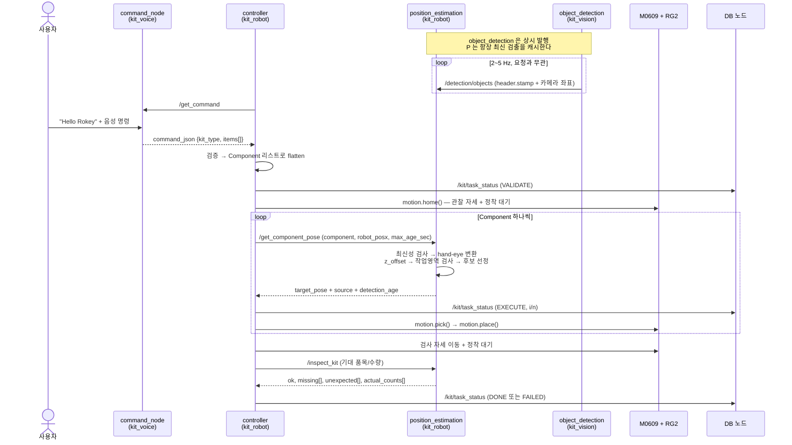
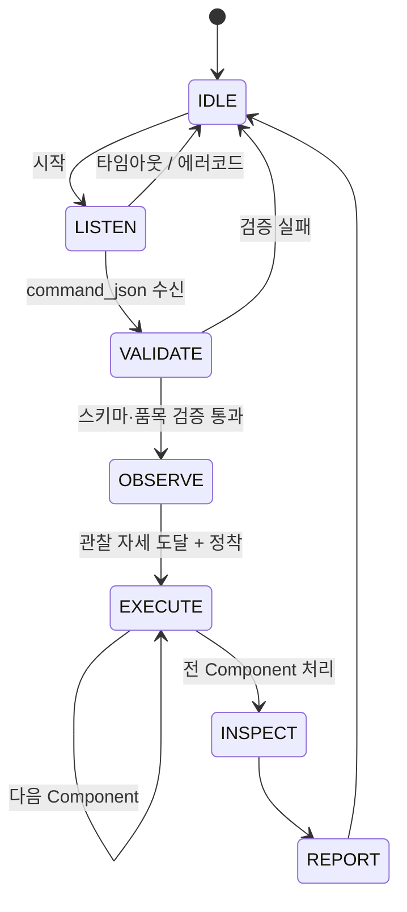

# 03. 시스템 플로우

관련 문서: [01 아키텍처](01-architecture.md) · [02 인터페이스 계약](02-interfaces.md) · [04 로드맵](04-roadmap.md)

---

## 1. 전체 시퀀스



주목할 점 둘.

**검출은 루프 밖에서 계속 돈다.** `object_detection` 은 controller 가 뭘 하든 상관없이 발행한다. `position_estimation` 은 그걸 받아 캐시만 하고, 계산은 요청이 올 때 한다. 이 덕분에 로봇을 세워둔 채 `ros2 topic echo /detection/objects` 로 인식 상태를 볼 수 있다.

**controller 가 `robot_posx` 를 채워 보낸다.** `position_estimation` 은 로봇 API 를 모른다. 근거는 [02 인터페이스 2.5절](02-interfaces.md).

---

## 2. 상태머신



상위 상태머신은 이게 전부다. **파지·배치·재시도는 전부 `EXECUTE` 안의 `execute_component()` 로 내려간다.**

`PICK`/`PLACE`/`RETRY` 를 최상위 상태로 두지 않는 이유: 그러면 "지금 몇 번째 품목의 몇 번째 재시도인지" 를 최상위 상태머신이 들고 있어야 하고, 상태 개수가 품목 수와 재시도 횟수의 곱으로 불어난다. 한 단계 내리면 상위는 7개 상태로 고정되고, 반복은 평범한 `for` 루프가 된다.

| 상태 | 진입 조건 | 수행 | 정상 전이 | 실패 처리 |
| --- | --- | --- | --- | --- |
| `IDLE` | 시작 / 작업 종료 | `motion.home()` — 관찰 자세, 그리퍼 개방 | `LISTEN` | — |
| `LISTEN` | 사용자 시작 | `/get_command` 호출 (타임아웃 60초) | `VALIDATE` | 에러코드별 처리 → `IDLE` |
| `VALIDATE` | 명령 수신 | JSON 파싱, 품목·수량 재검증, **Component 리스트로 flatten** | `OBSERVE` | 로그 후 `IDLE` |
| `OBSERVE` | 검증 통과 | 관찰 자세 이동 + **정착 대기**, `robot_posx` 캡처 | `EXECUTE` | 이동 실패 시 `REPORT` |
| `EXECUTE` | 관찰 자세 도달 | Component 를 하나씩 `execute_component()` | 전부 처리 시 `INSPECT` | Component 개별 실패는 흡수 |
| `INSPECT` | 전 Component 처리 | 검사 자세 이동 + 정착, `/inspect_kit` | `REPORT` | 검사 실패도 `REPORT` (결과에 기록) |
| `REPORT` | 검사 완료 | 최종 `TaskStatus` 발행 (DONE/FAILED) | `IDLE` | — |

**정착 대기(settle)가 상태로 드러나는 이유:** eye-in-hand 라서 팔이 멈춘 뒤에 찍힌 프레임이어야 좌표가 맞는다. `mwait()` 만으로는 부족하고, 검출 파이프라인이 새 프레임을 한 바퀴 도는 시간이 더 필요하다. 이걸 코드 어딘가의 `sleep` 으로 묻지 않고 상태 진입 조건으로 명시한다.

---

## 3. Component 단위 실행

이번 설계의 중심이다. 실행 단위를 "레시피" 가 아니라 **"component 하나"** 로 잡는다.

### 3.1 레시피를 flatten 한다

```python
@dataclass
class Component:
    name: str                  # "cup_ramen"
    slot: str                  # 배치 슬롯
    index: int                 # 실행 순번
    attempts: int = 0
    state: str = "PENDING"     # PENDING | DONE | SKIPPED
    fail_reason: str = ""
```

`{"cup_ramen": 2, "mask": 1}` → Component **3개**.

수량 2 는 Component 2개다. **실행 루프에서 수량 개념이 사라지고 균일한 리스트가 된다.** 이게 요점이다 — 루프가 "이 품목을 몇 개째 집는 중인지" 를 세지 않으므로, 부분 실패 처리가 단순해진다. 3개 중 2번째만 실패하면 그 Component 만 `SKIPPED` 가 되고 나머지는 영향이 없다.

### 3.2 실행 루프

```python
for comp in self.components:
    self.execute_component(comp)     # 실패해도 다음 Component 로 진행
    self.publish_status(comp)
```

한 Component 의 실패가 전체를 중단시키지 않는다. 최종 판정은 `INSPECT` 가 실물을 보고 내린다 — 기획서의 "작업 실행 여부가 아니라 실제 키트 구성 결과를 기준으로 성공 판정" 이 이 구조로 구현된다.

### 3.3 `execute_component()`

```python
def execute_component(self, comp) -> bool:
    for attempt in range(MAX_ATTEMPTS):        # 2
        comp.attempts = attempt + 1

        res = self.request_pose(comp.name)     # /get_component_pose
        if not res.success:
            if res.error_code in ("stale", "not_detected"):
                self.motion.home(); self.settle()   # 재정착 후 재시도
                continue
            comp.state, comp.fail_reason = "SKIPPED", res.error_code
            return False                       # out_of_workspace 등은 재시도 무의미

        params = grasp.params(comp.name)
        if not self.motion.pick(res.target_pose, params):
            self.motion.home(); self.settle()   # 헛집음 — 장면이 바뀌었을 수 있다
            continue

        self.motion.place(comp.slot, params)
        comp.state = "DONE"
        return True

    comp.state, comp.fail_reason = "SKIPPED", "max_attempts"
    return False
```

**`out_of_workspace` 에서 재시도하지 않는 이유:** 좌표가 작업영역 밖이라는 건 캘리브레이션이나 depth 가 틀렸다는 뜻이고, 다시 찍어도 같은 결과가 나온다. 재시도는 "다시 보면 달라질 수 있는" 실패(`stale`, `not_detected`, 헛집음)에만 쓴다.

**재시도 상한을 2회로 두는 이유:** 무한 재시도는 실패를 감추고 시연을 멈춘다. 2회 실패하면 건너뛰고 `INSPECT` 가 "빠졌다" 고 판정하게 둔다. 실패가 결과에 정직하게 드러나는 게 낫다.

---

## 4. 파지 좌표 파이프라인

이 프로젝트에서 내가 맡은 가장 핵심적인 부분이다. YOLO 가 준 픽셀을 로봇이 움직일 수 있는 좌표로 바꾸는 구간.

### 4.1 두 노드가 나눠 갖는다

계산 단계 자체는 레퍼런스와 같지만, **어느 노드가 어디까지 하는지**가 이 설계의 핵심이다.

| | `object_detection` (kit_vision) | `position_estimation` (kit_robot) |
| --- | --- | --- |
| 단계 | ① mask 무게중심 → ② depth 중앙값 → ③ 역투영 → polygon 첨부 | ④ hand-eye → ⑤ z_offset → ⑥ 작업영역 → ⑦ 파지 방향(mask 최소폭 축) → ⑧ 후보 선정 |
| 산출 | `camera_xyz` + `masking_map` (토픽 발행) | `target_pose` (서비스 응답) |
| 입력 | color / depth / camera_info | 검출 토픽 + request 의 `robot_posx` |
| 의존성 | ultralytics, torch, GPU | numpy 만 |

**①②③ 이 한 노드에 묶인 이유:** 이 세 단계는 color 프레임, depth 프레임, camera_info 를 모두 필요로 한다. `object_detection` 만이 셋을 다 갖고 있으므로 여기서 끝내면 **시각 동기가 자동으로 맞는다.** 픽셀만 발행하고 나중에 depth 를 붙이면 `message_filters` 로 프레임을 짝지어야 하고, 그건 새 버그 표면이다.

**④ 가 로봇 패키지에 있는 이유:** hand-eye 행렬과 작업영역은 로봇 좌표계 지식이다. 그리고 이 노드는 torch 없이 도는 CPU 노드라 로봇 컨테이너에 가볍게 들어간다.


```
seg mask ──▶ 무게중심 픽셀 (cx, cy)         seg mask ──▶ polygon (masking_map)
                │                                            │
                ▼                                            ▼
        mask 영역 depth 중앙값 cz                    최소 외접 사각형 → 최소 폭 축 각도
                │                                            │
                ▼                                            │        ← 여기까지 object_detection 담당,
     역투영 → 카메라 좌표 (X, Y, Z)                              │          /detection/objects 발행 내용
                │                                            │          (camera_xyz + masking_map)
                ▼                                            │
   base2cam = base2gripper(request 의 robot_posx) @ gripper2cam     │
                │                                            │
                ▼                                            ▼
        베이스 좌표 (x, y, z)                    최소 폭 축 각도 → rz 로 좌표계 변환
                │                                            │       ← 여기부터 position_estimation 담당
                ▼                                            │
   z += 품목별 z_offset, 작업영역 클램프                          │
                │                                            │
                └──────────────────┬─────────────────────────┘
                                    ▼
                       posx = [x, y, z, rx, ry, rz]   ← rx,ry 는 관찰 자세 값 재사용, rz 는 mask 최소폭 축에서 계산
```

### 4.2 단계별 상세

**① 무게중심 픽셀** — bbox 중심이 아니라 **seg mask 의 무게중심**을 쓴다. 레퍼런스는 detection 모델이라 `(x1+x2)/2, (y1+y2)/2` 를 썼지만, 우리는 segmentation 이다. 컵라면처럼 기울어져 있거나 샴푸처럼 길쭉한 물체는 bbox 중심이 물체 밖(혹은 가장자리)에 떨어질 수 있다. mask 무게중심은 항상 물체 위에 있다. 이게 seg 모델을 쓰는 실질적 이득이다.

**② depth 중앙값** — 레퍼런스 `detection.py:_get_depth` 는 중심 픽셀 주변 5×5 윈도우의 0 아닌 값 중앙값을 썼다. 이걸 **mask 영역 전체**로 확장한다. 평균이 아니라 중앙값인 이유는 RealSense 가 물체 경계에서 튀는 값(비행시간 오차)을 내기 때문이다. 한 픽셀만 잘못 읽어도 팔이 엉뚱한 높이로 내려간다.

```python
# 0 은 무효 측정값이다. 반드시 제외한다.
valid = depth_frame[mask > 0]
valid = valid[valid > 0]
cz = float(np.median(valid)) if valid.size else None
```

**③ 역투영** — 레퍼런스 `_pixel_to_camera_coords` 그대로.

```python
X = (cx - ppx) * cz / fx
Y = (cy - ppy) * cz / fy
Z = cz
```

`fx, fy, ppx, ppy` 는 `/camera/color/camera_info` 에서 받는다. depth 를 color 에 정렬한 `/camera/aligned_depth_to_color/image_raw` 를 구독하므로 color intrinsic 을 그대로 쓰는 게 맞다.

**④ hand-eye 변환** — 레퍼런스 `transform_to_base` 그대로.

```python
base2gripper = pose_matrix(*get_current_posx()[0])   # ZYZ 오일러 → 4x4
base2cam     = base2gripper @ gripper2cam            # T_gripper2camera.npy
base_xyz     = (base2cam @ [X, Y, Z, 1])[:3]
```

카메라가 그리퍼에 붙어 있으므로(eye-in-hand) **촬영 시점의 posx** 를 써야 한다. 팔이 움직인 뒤에 변환하면 틀린다. 검출 요청 직전에 posx 를 캡처해두고 그 값으로 변환한다.

**⑤ 오프셋과 클램프 — 캘리브레이션 지점**

```python
p = grasp_params(class_name)          # resource/grasp_params.json
z = base_xyz[2] + p["z_offset"]       # 레퍼런스 기본값 -35.0
z = max(z, MIN_DEPTH)                 # 2.0. 테이블 뚫는 것 방지
```

`z_offset` 은 "카메라가 본 물체 표면" 과 "그리퍼가 잡아야 할 높이" 의 차이다. 물체 높이와 그리퍼 손가락 길이에 따라 달라지므로 **품목별로 실측해서 JSON 에 채운다.** 이 값을 코드 상수로 박아두면 9종 품목을 하나의 숫자로 커버하려다 실패한다.

**⑥ 자세** — `rx, ry` 는 관찰 자세 posx 의 값을 그대로 쓴다. 그리퍼가 수직으로 내려가는 것 자체는 고정이다. `rz`(그리퍼가 닫히는 방향)는 이제 고정값이 아니라 아래 ⑦에서 계산한다.

**⑦ 파지 방향 — mask 최소폭 축**

```python
# masking_map: object_detection 이 실어 보낸 polygon (픽셀 좌표, [x1,y1,x2,y2,...])
rect = cv2.minAreaRect(polygon_points)     # ((cx,cy), (w,h), angle)
short_side_angle = rect[2] if rect[1][0] < rect[1][1] else rect[2] + 90
```

평행 조(jaw) 그리퍼는 물체의 **가장 좁은 단면을 가로질러** 잡아야 안정적으로 닫힌다. 컵라면처럼 옆으로 누워 있거나 샴푸처럼 길쭉한 품목은 아무 각도로나 잡으면 그리퍼가 완전히 안 닫히거나 미끄러진다. `masking_map`(폴리곤)에 최소 외접 사각형을 씌워 짧은 변의 방향을 구하고, 그 각도를 그리퍼 폐쇄 축(`rz`)으로 삼는다.

계산은 `position_estimation`이 한다. `masking_map`은 순수 좌표 배열이라 numpy(+cv2 기하 연산)만으로 되고, 이 노드가 torch 없이 도는 CPU 노드라는 전제([§4.1](#41-두-노드가-나눠-갖는다))는 안 깨진다. 카메라 픽셀 평면에서 구한 각도는 관찰 자세의 회전 성분만큼 베이스 좌표계로 보정해서 최종 `rz`에 넣는다.

**폴백:** 이 계산이 실패하거나(폴리곤이 비었거나 자체검증을 못 넘기면) `rz`는 관찰 자세 값으로 되돌린다 — 회전 정렬을 못 해도 기존 수직 하향 파지는 그대로 동작해야 한다.

### 4.3 작업영역 검사

변환된 좌표가 로봇이 갈 수 없는 곳이면 **움직이기 전에** 걸러야 한다. 캘리브레이션이 틀어졌거나 depth 가 튀면 좌표가 수 미터 밖으로 나온다.

```python
WORKSPACE = {"x": (200, 800), "y": (-400, 400), "z": (0, 500)}  # mm, 실측 후 조정
```

범위 밖이면 그 품목을 건너뛰고 `detail` 에 사유를 기록한다. `movel` 로 넘기지 않는다. 이건 안전 장치이므로 생략하지 않는다.

### 4.4 검증

좌표 변환은 `position_estimation` 에 있고 로봇 API 를 import 하지 않으므로, **로봇 없이 그대로 실행해 검증할 수 있다.** 모듈 하단에 self-check 를 붙인다.

```python
if __name__ == "__main__":
    # 항등 hand-eye 행렬 + 원점 자세면 카메라 좌표가 그대로 베이스 좌표여야 한다
    T = np.eye(4)
    assert np.allclose(transform_to_base([100, 0, 500], T, [0, 0, 0, 0, 0, 0]),
                       [100, 0, 500])
    # 베이스가 x 로 200 평행이동하면 결과도 200 만큼 이동
    assert np.allclose(transform_to_base([100, 0, 500], T, [200, 0, 0, 0, 0, 0]),
                       [300, 0, 500])
    print("ok")
```

`python3 position_estimation.py` 로 바로 돈다. 캘리브레이션 자체의 정확도는 `reference/corecode/Calibration_Tutorial/verify.py` 로 확인한다.

---

## 5. motion.py — controller 가 쓰는 라이브러리

### 5.1 공개 API

```python
init(node_id="dsr01", model="m0609")   # DR_init 설정 + DSR_ROBOT2 바인딩. 최초 1회 필수
home()                                 # 관찰 자세 복귀 + 그리퍼 개방
current_posx() -> list[6]              # controller 가 request 의 robot_posx 를 채울 때
pick(target_pose, params) -> bool      # 접근 → 하강 → 파지 → 파지확인 → 상승
place(slot, params)                    # 슬롯 위 → 하강 → 개방 → 상승
```

controller 는 이 다섯 개만 쓴다. `movej`/`movel`/`mwait` 를 직접 부르지 않는다 — 그러면 controller 가 `DSR_ROBOT2` 를 import 하게 되고, `init()` 으로 순서를 강제한 의미가 사라진다.

**`init()` 을 반드시 먼저 호출한다.** 레퍼런스는 모듈 최상단에서 DR_init 을 설정해서 import 순서에 의존했고, 그래서 라이브러리로 쓸 수 없었다. 근거는 [01 아키텍처 4.3절](01-architecture.md).

### 5.2 component 별 모션 차이는 파라미터로 흡수한다

품목마다 별도 전략 함수를 만들지 않는다. 9종이 전부 수직 하향 파지로 가능하다는 전제이고, 차이는 `grasp_params.json` 의 폭·힘·`z_offset`·`approach` 로 흡수된다.

```json
{"strategy": "top_down", "width": 800, "force": 150, "z_offset": -25.0, "approach": 120.0}
```

`strategy` 필드는 두되 `"top_down"` 하나만 구현하고, 다른 값이 오면 명시적으로 에러를 낸다. **확장점만 표시하고 코드는 쓰지 않는다.** Day 8 품목별 파지 시험에서 수직 하향으로 안 되는 품목이 실제로 나오면 그때 전략을 추가한다.

### 5.3 파지 시퀀스

레퍼런스 `pick_and_place_target` 을 슬롯 개념으로 확장한다.

```python
def pick(pose, params):
    p = params
    approach = pose[:2] + [pose[2] + p["approach"]] + pose[3:]

    movel(approach, vel=VEL, acc=ACC); mwait()   # 1. 물체 위로 접근
    movel(pose,     vel=VEL, acc=ACC); mwait()   # 2. 하강
    gripper.close_gripper(width=p["width"], force=p["force"])
    wait_gripper()                               # 3. 폐쇄 완료 대기
    if not grasped():                            # 4. 파지 확인
        return False
    movel(approach, vel=VEL, acc=ACC); mwait()   # 5. 상승
    return True
```

**접근 자세를 거치는 이유:** 목표 좌표로 `movel` 을 바로 쏘면 팔이 대각선으로 내려오면서 옆 물건을 쓸고 지나간다. 트레이에 물건이 붙어 있으면 반드시 위에서 수직으로 내려와야 한다. 레퍼런스는 파지 후 상승(`PLACE_LIFT`)만 있고 접근 상승이 없었는데, 공구 하나만 놓인 환경이라 문제가 안 됐던 것이다. 9종이 트레이에 늘어선 우리 환경에서는 필수다.

**`grasped()` 판정:** RG2 는 폭을 읽을 수 있다. 폐쇄 후 폭이 거의 0 이면 헛집은 것이다.

```python
def grasped():
    return gripper.get_width() > EMPTY_WIDTH_THRESHOLD   # 실측 후 결정
```

이게 없으면 빈 그리퍼로 슬롯까지 가서 놓는 시늉을 하고, `INSPECT` 단계에 가서야 실패를 안다. 조기에 잡아야 재시도할 수 있다.

**배치:**

```python
def place(slot_name, params):
    slot = PLACE_SLOTS[slot_name]                         # resource/place_slots.json
    movel(above(slot), vel=VEL, acc=ACC); mwait()
    movel(slot,        vel=VEL, acc=ACC); mwait()
    gripper.open_gripper(); wait_gripper()
    movel(above(slot), vel=VEL, acc=ACC); mwait()         # 놓고 빠져나온다
```

레퍼런스는 배치 후 상승이 없어서, 다음 `movej` 가 트레이를 스치는 경로를 탈 수 있었다. 놓고 나면 반드시 수직으로 빠져나온다.

---

## 6. 실패 모드와 대응

| 실패 모드 | 감지 방법 | 대응 |
| --- | --- | --- |
| 품목 미검출 | `error_code=not_detected` | 관찰 자세 재정착 후 재요청 → 그래도 없으면 건너뛰고 `missing` 으로 기록 |
| depth 무효 (전부 0) | `object_detection` 이 해당 검출을 발행하지 않음 | 위와 동일 경로. 계약상 로봇은 무효 좌표를 아예 못 받는다 |
| **검출 노후 (stale)** | `detection_age > max_age_sec` | 관찰 자세 재정착 후 재요청. **eye-in-hand 최대 위험** — 팔 이동 전 프레임이면 좌표가 통째로 틀린다 |
| **후보 소진** | `error_code=no_candidate` | 건너뛰고 `missing` 기록 |
| **`motion.init()` 미호출** | `RuntimeError` 즉시 발생 | 기동 실패로 처리. 조용히 진행하지 않는다 |
| 변환 좌표가 작업영역 밖 | `error_code=out_of_workspace` | **움직이지 않는다. 재시도도 하지 않는다** — 다시 봐도 같은 결과다. 반복되면 캘리브레이션 재수행 신호 |
| 파지 실패 (헛집음) | 폐쇄 후 그리퍼 폭 ≈ 0 | 개방 → 재검출 → 재시도 (최대 2회) |
| 파지 중 낙하 | 상승 후 폭 재확인 | 재시도. 낙하물 위치는 재검출로 갱신 |
| 슬롯 좌표 오류 | 배치 후 `INSPECT` 불일치 | 이번 작업은 실패 기록, `place_slots.json` 재실측 |
| 검사 불일치 (누락/오투입) | `/inspect_kit` 의 `ok=false` | `REPORT` 에 `missing`/`unexpected` 기록. 자동 보정은 확장 범위 |
| LLM 크레딧 소진 | `error_code=openai_quota_exhausted` | 즉시 중단 + 에러 로그. 재시도 무의미 |
| 로봇 통신 두절 | `movel` 예외 | 그리퍼 개방 시도 후 노드 종료. 조용히 계속하지 않는다 |

**공통 원칙:** 좌표가 의심스러우면 움직이지 않는다. 로봇은 물리적으로 움직이는 장비고, 잘못된 좌표 하나가 장비나 사람을 상하게 한다. "일단 해보고 안 되면 말고" 는 소프트웨어에서나 통한다.

---

## 7. 1차 범위 밖 (확장)

기획서가 확장 기능으로 분류한 것들. 지금 설계에 자리만 남겨두고 구현하지 않는다.

- 검사 결과 기반 **자동 보정** (누락 품목 추가 파지, 오투입 품목 방출) — `InspectKit` 응답의 `missing`/`unexpected` 가 이미 필요한 정보를 담고 있고, 보정도 결국 Component 실행이다. `missing` 을 Component 리스트로 다시 flatten 해서 `EXECUTE` 를 한 번 더 도는 것으로 붙는다.
- **3차원 형상 기반 파지점** — 현재는 mask 무게중심(xy) + mask 최소폭 축(rz, [§4.2](#42-단계별-상세)) + 수직 하향(rx,ry) 조합이다. 물체가 기울어진 채로 놓였을 때의 완전한 3D 파지 자세(포인트클라우드 기반)는 별개 작업으로 남긴다.
- **DB 세부 관리** — 로봇은 `/kit/task_status` 발행까지만 책임진다.
