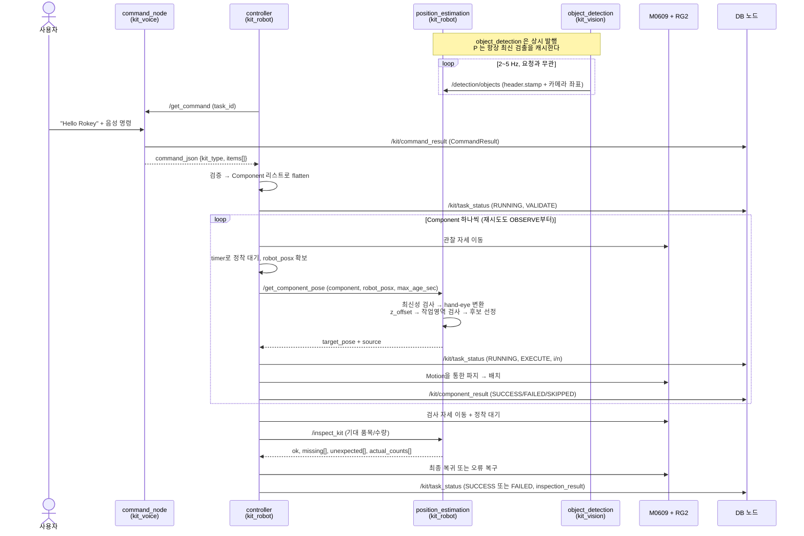
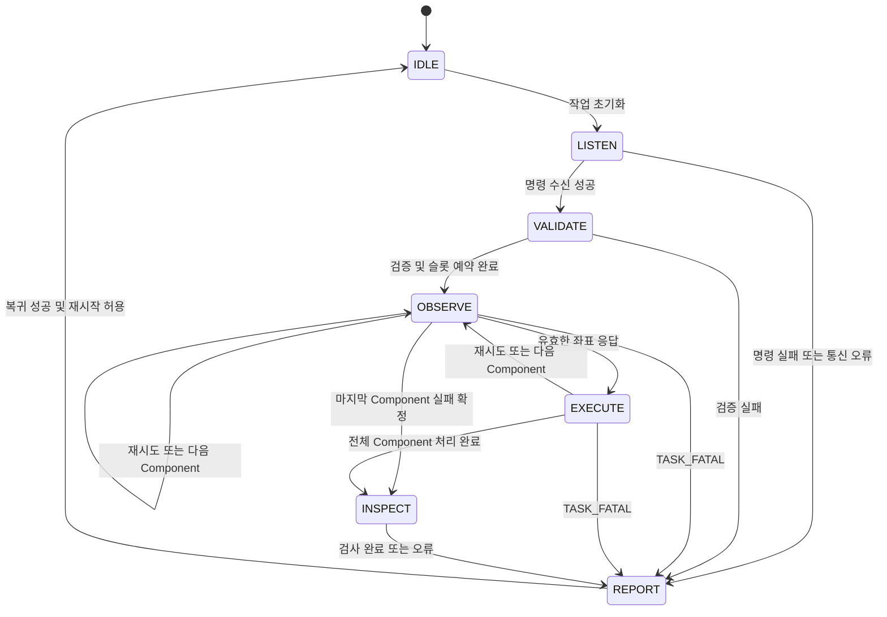

# 03. 시스템 플로우

관련 문서: [01 아키텍처](01-architecture.md) · [02 인터페이스 계약](02-interfaces.md) · [04 로드맵](04-roadmap.md)

---

## 1. 전체 시퀀스



주목할 점 둘.

**검출은 루프 밖에서 계속 돈다.** `object_detection` 은 controller 가 뭘 하든 상관없이 발행한다. `position_estimation` 은 그걸 받아 캐시만 하고, 계산은 요청이 올 때 한다. 이 덕분에 로봇을 세워둔 채 `ros2 topic echo /detection/objects` 로 인식 상태를 볼 수 있다.

**controller 가 `robot_posx` 를 채워 보낸다.** `position_estimation` 은 로봇 API 를 모른다. 근거는 [02 인터페이스 2.5절](02-interfaces.md).

---

## 2. 상태머신

### 2.0. 확정된 원칙

- Controller는 Enum + timer + 비동기 service future로 구성한다.
- Motion 객체는 외부에서 주입받는다.
- EXECUTE 한 번은 현재 Component의 pick/place 한 번만 처리한다.
- 재시도와 다음 Component 실행은 OBSERVE에서 시작한다.
- expected_counts는 검증된 원래 명령에서 생성하며 실행 중 변경하지 않는다.
- 최종 성공은 실물 검사 PASS를 기준으로 한다.
- TASK_FATAL 또는 최종 안전 복귀 실패가 있으면 FAILED다.
- EMERGENCY, 일시 정지, 실행 중 강제 중단은 이번 구현 범위에서 제외한다.

아래는 Controller 구현 계획이다. 기존 서비스 서버와 DB 구현은 유지한다.
Motion API 이름·반환 조건·내부 실행 방식의 합의는 이번 수정 범위에서 제외하며,
5절은 기존 제안으로 보존한다. 새 Controller 호출 계약으로 확정한 것은 아니다.



| 상태 | 진입 시 한 번 수행 | 이후 tick에서 확인 | 종료·전이 |
| --- | --- | --- | --- |
| IDLE | 변수 초기화, task_id 생성 | 없음 | LISTEN |
| LISTEN | 서비스 준비 대기 시작 | 준비되면 한 번 요청, future·deadline 확인 | 성공 → VALIDATE / 실패 → REPORT |
| VALIDATE | 검증, flatten, 전체 슬롯 예약, expected_counts 생성 | 없음 | 성공 → OBSERVE / 실패 → REPORT |
| OBSERVE | Attempt 시작, 관찰 자세 이동 | 정착 후 자세 확보·좌표 요청 한 번, future 확인 | 성공 → EXECUTE / 실패 → 오류 정책 적용 |
| EXECUTE | 현재 Component의 pick/place 한 번 | 없음 | 다음 Component → OBSERVE / 전체 완료 → INSPECT |
| INSPECT | 검사 자세 이동 | 정착 후 검사 요청 한 번, future 확인 | REPORT |
| REPORT | 미완료 결과 정리, 필요한 복귀·복구, 최종 결과 한 번 발행 | 자동 재시작 차단 시 유지 | 복귀 성공 및 재시작 허용 → IDLE |

### 2.1 timer와 future 관리

- 상태 진입 작업과 매 tick 확인 작업을 구분한다. 이동·서비스 요청·최종 발행을 반복하지 않는다.
- 정착은 준비 시각 비교로 처리한다. Controller에서 sleep이나 future 완료까지의 대기 루프를 사용하지 않는다.
- 서비스 요청은 동시에 하나만 진행한다. 요청한 tick은 반환하고 이후 tick에서 완료 여부를 확인한다.
- 서비스 준비 대기와 응답 대기는 별도 deadline으로 관리한다. future 예외와 응답 내용도 검사한다.
- timeout 이후 늦은 결과를 현재 작업에 반영하지 않는다. future 취소는 서버 실행 취소를 보장하지 않는다.
- task_id는 단일 Controller 운영을 전제로 UTC 마이크로초 형식 `TASK-20260905T053012123456Z`로 IDLE 진입 시 한 번 생성한다.
- 짧은 timer 주기는 Motion 호출의 비동기 실행을 의미하지 않는다. 실제 연결 시 executor 응답 처리와 호출 정체 여부를 확인한다. Motion 계약은 별도 합의 대상이다.

### 2.2 설정 소유권

| 정보 | 소유·사용 경계 |
| --- | --- |
| 지원 품목 | 기존 `kit_vision/resource/class_names.json` 기준 |
| 품목별 사용 가능 슬롯 이름 | 설정 로더가 model에 전달할 메타데이터. VALIDATE에서 예약 |
| 슬롯 좌표·접근 높이·이동 설정 | Motion 영역. Controller는 해석하지 않음 |
| 파지 폭·힘 등 | Motion 영역 |
| grasp_params.json의 z_offset | 기존 position_estimation이 target_pose에 반영하는 책임 유지. Controller에서 중복 보정하지 않음 |
| timer·서비스 대기·정착·시도 제한 | Controller 파라미터 |

`place_slots.json`, `motion.yaml`과 슬롯 메타데이터 로더는 구현 예정이다.
파일 구조와 배포 등록은 해당 구현 단계에서 추가하며 기존 grasp 설정 형식은 변경하지 않는다.

서비스 준비 timeout, 명령·좌표·검사 응답 timeout은 각각 독립 파라미터로 둔다.
기존 문서의 명령 timeout 60초는 전체 처리 상한이 검증된 값이 아니다. 현재 음성 노드는
웨이크워드에 최대 30초를 사용하고 이후 STT·LLM을 수행한다. 수치는 실제 지연과 담당자 확인을
거쳐 정하며 무한 대기를 기본값으로 두지 않는다.

초기 비전 설정은 max_age_sec=1.0, 관찰·검사 정착 1.2초, exclude_taken=[]다.
동일 시간 기준과 이동 완료 시점의 정확성을 전제로 실기에서 검증한다. 검사 화면은 완성
트레이만 포함한다. 기존 서버는 ROI 필터나 촬영 시각 하한 요청을 지원하지 않는다.
세부 전제는 02 문서 2.6~2.7절을 따른다.

## 3. Component 단위 실행

### 3.1 검증·flatten·슬롯 예약

controller_model.py는 ROS·DSR 의존성 없이 명령 검증, Component·Attempt 데이터,
flatten, 슬롯 예약, expected_counts 생성을 담당한다.

- kit_type은 문자열, items는 비어 있지 않은 배열이어야 한다.
- 음성 노드의 raw_text/task_id 추가 필드는 추후 제거 예정이다. 과도기에는 실행 해석에서 무시하고 Controller의 task_id를 유지한다.
- 품목명은 지원 클래스여야 하며 qty는 bool을 제외한 1 이상 정수다. 문자열·실수를 자동 변환하지 않는다.
- 중복 품목 행은 합산하고 최초 등장 순서로 실행한다. 수량 하나당 Component 하나를 만든다.
- Component index는 0부터 시작한다. 슬롯은 VALIDATE에서 모두 예약하며 부족하면 이동 전에 FAILED 처리한다.
- 실패한 Component의 슬롯도 다른 Component에 재할당하지 않는다.
- expected_counts는 원래 검증된 명령의 총수량이며 실행 결과에 따라 줄이지 않는다.

| 모델 | 최소 데이터 |
| --- | --- |
| Component | 품목, index, slot, 상태, Attempt 목록, 오류 코드·상세, 시작·종료 시각 |
| Attempt | attempt_no, 상태, 시작·종료 시각, 실패 단계, 오류 코드·상세 |

Component 상태는 내부 PENDING, 최종 SUCCESS·FAILED·SKIPPED다. Attempt 번호는 1부터
연속 증가하며 완료된 시도의 상태는 SUCCESS 또는 FAILED다. 서비스 source는 진단용으로
기록할 수 있으나 Controller가 검출 토픽을 직접 구독하지 않는다.

### 3.2 실행과 재시도

한 Attempt는 OBSERVE 진입부터 좌표 획득과 pick/place 성공 또는 실패까지다.
`max_attempts=2`는 최초 시도 1회와 재시도 1회, 총 2회를 뜻한다.

1. OBSERVE에서 Attempt를 시작하고 관찰·정착 후 좌표를 비동기 요청한다.
2. 응답 성공 시 target_pose의 6개 값이 유한한 수인지 검사하고 EXECUTE로 전환한다.
3. EXECUTE의 execute_component()는 저장된 좌표로 pick/place 한 번만 수행한다.
4. 재시도 오류는 Attempt에 기록하고 이전 target_pose를 폐기한 뒤 OBSERVE로 돌아간다.
5. Component 결과가 확정되면 한 번 발행한다. 다음 Component가 없으면 INSPECT로 전환한다.

재시도 반복문이나 좌표 서비스 대기를 execute_component() 안에 넣지 않는다.
stale·not_detected는 재관찰하고, grasp_failed는 필요한 안전 복구 후 재관찰한다.
시도 소진 시 Component 오류는 max_attempts로 기록하되 마지막 Attempt의 실제 원인은 보존한다.

### 3.3 검사·최종 결과·발행

- 최신의 유효한 검사 응답에서 ok=true이면 PASS, ok=false이면 FAIL이다.
- 검사 timeout·예외·검출 없음·오래된 검출·응답 형식 오류는 ERROR다. srv 표현은 02 문서 2.7절을 따른다.
- Task SUCCESS 조건은 **검사 PASS이며 TASK_FATAL과 최종 복귀 실패가 없는 것**이다.
- Component가 FAILED여도 위 조건을 만족하면 Task는 SUCCESS다. 실행 이력과 실물 검사 결과를 각각 보존한다.
- 검사 미수행 시 inspection_result는 빈 문자열이다. 검사 단계에서 발생한 오류는 ERROR JSON으로 기록한다.
- TaskStatus는 상태 전이 시 RUNNING, REPORT의 복귀 처리 이후 최종 SUCCESS/FAILED를 한 번 발행한다.
- ComponentResult는 최종 확정 시 한 번 발행한다. 재시도마다 최종 결과를 발행하지 않는다.
- TASK_FATAL 시 시작한 Component는 FAILED, 미시작 Component는 SKIPPED로 확정한다. SKIPPED는 Attempt가 없으며 시작·종료 시각에는 건너뛰기로 확정한 시각을 기록한다.
- 현재 Component가 없는 TaskStatus는 이름을 빈 문자열, index를 -1로 둔다.
- 복귀 실패 시 REPORT에 머물며 자동 재시작·중복 복귀·중복 최종 발행을 막는다. 복구 후 재가동은 운영자 확인 대상이다.

DB 재고 차감은 기존대로 최초 SUCCESS Component 기준이다. Task 검사 PASS가 FAILED
Component의 재고를 소급 차감하지 않는다. 기존 DB 집계·재고 정책은 변경하지 않는다.

### 3.4 1단계 계약 검증 시나리오

| 시나리오 | 기대 결과 |
| --- | --- |
| 두 Component 배치, 검사 PASS, 복귀 성공 | Task SUCCESS |
| 첫 파지 실패, 두 번째 시도 성공 | Attempt 2개, Component SUCCESS |
| 일부 Component 실패, 검사 PASS, 치명 오류 없음·복귀 성공 | 실패 이력 유지, Task SUCCESS |
| 모든 배치 성공, 검사 FAIL | Task FAILED |
| 좌표 서비스 timeout | TASK_FATAL, 현재 FAILED·미실행 SKIPPED, REPORT |
| 검사 서비스 timeout | 검사 ERROR, Task FAILED |
| 배치 실패 | TASK_FATAL, 미실행 SKIPPED, REPORT |
| 검사 PASS 이후 복귀 실패 | Task FAILED, REPORT 유지 |

---

## 4. 파지 좌표 파이프라인

이 프로젝트에서 내가 맡은 가장 핵심적인 부분이다. YOLO 가 준 픽셀을 로봇이 움직일 수 있는 좌표로 바꾸는 구간.

### 4.1 두 노드가 나눠 갖는다

계산 단계 자체는 레퍼런스와 같지만, **어느 노드가 어디까지 하는지**가 이 설계의 핵심이다.

| | `object_detection` (kit_vision) | `position_estimation` (kit_robot) |
| --- | --- | --- |
| 단계 | ① mask 무게중심 → ② depth 중앙값 → ③ 역투영 → polygon 첨부 | ④ hand-eye → ⑤ z_offset → ⑥ 작업영역 → ⑦ 파지 방향(mask 최소폭 축) → ⑧ 후보 선정 |
| 산출 | `camera_xyz` + `masking_map` (토픽 발행) | `target_pose` (서비스 응답) |
| 입력 | color / depth / camera_info | 검출 토픽 + request 의 `robot_posx` |
| 의존성 | ultralytics, torch, GPU | numpy 만 |

**①②③ 이 한 노드에 묶인 이유:** 이 세 단계는 color 프레임, depth 프레임, camera_info 를 모두 필요로 한다. `object_detection` 만이 셋을 다 갖고 있으므로 여기서 끝내면 **시각 동기가 자동으로 맞는다.** 픽셀만 발행하고 나중에 depth 를 붙이면 `message_filters` 로 프레임을 짝지어야 하고, 그건 새 버그 표면이다.

**④ 가 로봇 패키지에 있는 이유:** hand-eye 행렬과 작업영역은 로봇 좌표계 지식이다. 그리고 이 노드는 torch 없이 도는 CPU 노드라 로봇 컨테이너에 가볍게 들어간다.


```
seg mask ──▶ 무게중심 픽셀 (cx, cy)         seg mask ──▶ polygon (masking_map)
                │                                            │
                ▼                                            ▼
        mask 영역 depth 중앙값 cz                    최소 외접 사각형 → 최소 폭 축 각도
                │                                            │
                ▼                                            │        ← 여기까지 object_detection 담당,
     역투영 → 카메라 좌표 (X, Y, Z)                              │          /detection/objects 발행 내용
                │                                            │          (camera_xyz + masking_map)
                ▼                                            │
   base2cam = base2gripper(request 의 robot_posx) @ gripper2cam     │
                │                                            │
                ▼                                            ▼
        베이스 좌표 (x, y, z)                    최소 폭 축 각도 → rz 로 좌표계 변환
                │                                            │       ← 여기부터 position_estimation 담당
                ▼                                            │
   z += 품목별 z_offset, 작업영역 클램프                          │
                │                                            │
                └──────────────────┬─────────────────────────┘
                                    ▼
                       posx = [x, y, z, rx, ry, rz]   ← rx,ry 는 관찰 자세 값 재사용, rz 는 mask 최소폭 축에서 계산
```

### 4.2 단계별 상세

**① 무게중심 픽셀** — bbox 중심이 아니라 **seg mask 의 무게중심**을 쓴다. 레퍼런스는 detection 모델이라 `(x1+x2)/2, (y1+y2)/2` 를 썼지만, 우리는 segmentation 이다. 컵라면처럼 기울어져 있거나 샴푸처럼 길쭉한 물체는 bbox 중심이 물체 밖(혹은 가장자리)에 떨어질 수 있다. mask 무게중심은 항상 물체 위에 있다. 이게 seg 모델을 쓰는 실질적 이득이다.

**② depth 중앙값** — 레퍼런스 `detection.py:_get_depth` 는 중심 픽셀 주변 5×5 윈도우의 0 아닌 값 중앙값을 썼다. 이걸 **mask 영역 전체**로 확장한다. 평균이 아니라 중앙값인 이유는 RealSense 가 물체 경계에서 튀는 값(비행시간 오차)을 내기 때문이다. 한 픽셀만 잘못 읽어도 팔이 엉뚱한 높이로 내려간다.

```python
# 0 은 무효 측정값이다. 반드시 제외한다.
valid = depth_frame[mask > 0]
valid = valid[valid > 0]
cz = float(np.median(valid)) if valid.size else None
```

**③ 역투영** — 레퍼런스 `_pixel_to_camera_coords` 그대로.

```python
X = (cx - ppx) * cz / fx
Y = (cy - ppy) * cz / fy
Z = cz
```

`fx, fy, ppx, ppy` 는 `/camera/color/camera_info` 에서 받는다. depth 를 color 에 정렬한 `/camera/aligned_depth_to_color/image_raw` 를 구독하므로 color intrinsic 을 그대로 쓰는 게 맞다.

**④ hand-eye 변환** — 레퍼런스 `transform_to_base` 그대로.

```python
base2gripper = pose_matrix(*get_current_posx()[0])   # ZYZ 오일러 → 4x4
base2cam     = base2gripper @ gripper2cam            # T_gripper2camera.npy
base_xyz     = (base2cam @ [X, Y, Z, 1])[:3]
```

카메라가 그리퍼에 붙어 있으므로(eye-in-hand) **촬영 시점의 posx** 를 써야 한다. 팔이 움직인 뒤에 변환하면 틀린다. 검출 요청 직전에 posx 를 캡처해두고 그 값으로 변환한다.

**⑤ 오프셋과 클램프 — 캘리브레이션 지점**

```python
p = grasp_params(class_name)          # resource/grasp_params.json
z = base_xyz[2] + p["z_offset"]       # 레퍼런스 기본값 -35.0
z = max(z, MIN_DEPTH)                 # 2.0. 테이블 뚫는 것 방지
```

`z_offset` 은 "카메라가 본 물체 표면" 과 "그리퍼가 잡아야 할 높이" 의 차이다. 물체 높이와 그리퍼 손가락 길이에 따라 달라지므로 **품목별로 실측해서 JSON 에 채운다.** 이 값을 코드 상수로 박아두면 9종 품목을 하나의 숫자로 커버하려다 실패한다.

**⑥ 자세** — `rx, ry` 는 관찰 자세 posx 의 값을 그대로 쓴다. 그리퍼가 수직으로 내려가는 것 자체는 고정이다. `rz`(그리퍼가 닫히는 방향)는 이제 고정값이 아니라 아래 ⑦에서 계산한다.

**⑦ 파지 방향 — mask 최소폭 축**

```python
# masking_map: object_detection 이 실어 보낸 polygon (픽셀 좌표, [x1,y1,x2,y2,...])
rect = cv2.minAreaRect(polygon_points)     # ((cx,cy), (w,h), angle)
short_side_angle = rect[2] if rect[1][0] < rect[1][1] else rect[2] + 90
```

평행 조(jaw) 그리퍼는 물체의 **가장 좁은 단면을 가로질러** 잡아야 안정적으로 닫힌다. 컵라면처럼 옆으로 누워 있거나 샴푸처럼 길쭉한 품목은 아무 각도로나 잡으면 그리퍼가 완전히 안 닫히거나 미끄러진다. `masking_map`(폴리곤)에 최소 외접 사각형을 씌워 짧은 변의 방향을 구하고, 그 각도를 그리퍼 폐쇄 축(`rz`)으로 삼는다.

계산은 `position_estimation`이 한다. `masking_map`은 순수 좌표 배열이라 numpy(+cv2 기하 연산)만으로 되고, 이 노드가 torch 없이 도는 CPU 노드라는 전제([§4.1](#41-두-노드가-나눠-갖는다))는 안 깨진다. 카메라 픽셀 평면에서 구한 각도는 관찰 자세의 회전 성분만큼 베이스 좌표계로 보정해서 최종 `rz`에 넣는다.

**폴백:** 이 계산이 실패하거나(폴리곤이 비었거나 자체검증을 못 넘기면) `rz`는 관찰 자세 값으로 되돌린다 — 회전 정렬을 못 해도 기존 수직 하향 파지는 그대로 동작해야 한다.

### 4.3 작업영역 검사

변환된 좌표가 로봇이 갈 수 없는 곳이면 **움직이기 전에** 걸러야 한다. 캘리브레이션이 틀어졌거나 depth 가 튀면 좌표가 수 미터 밖으로 나온다.

```python
WORKSPACE = {"x": (200, 800), "y": (-400, 400), "z": (0, 500)}  # mm, 실측 후 조정
```

범위 밖이면 그 품목을 건너뛰고 `detail` 에 사유를 기록한다. `movel` 로 넘기지 않는다. 이건 안전 장치이므로 생략하지 않는다.

### 4.4 검증

좌표 변환은 `position_estimation` 에 있고 로봇 API 를 import 하지 않으므로, **로봇 없이 그대로 실행해 검증할 수 있다.** 모듈 하단에 self-check 를 붙인다.

```python
if __name__ == "__main__":
    # 항등 hand-eye 행렬 + 원점 자세면 카메라 좌표가 그대로 베이스 좌표여야 한다
    T = np.eye(4)
    assert np.allclose(transform_to_base([100, 0, 500], T, [0, 0, 0, 0, 0, 0]),
                       [100, 0, 500])
    # 베이스가 x 로 200 평행이동하면 결과도 200 만큼 이동
    assert np.allclose(transform_to_base([100, 0, 500], T, [200, 0, 0, 0, 0, 0]),
                       [300, 0, 500])
    print("ok")
```

`python3 position_estimation.py` 로 바로 돈다. 캘리브레이션 자체의 정확도는 `reference/corecode/Calibration_Tutorial/verify.py` 로 확인한다.

---

## 5. motion.py — controller 가 쓰는 라이브러리

### 5.1 공개 API

```python
init(node_id="dsr01", model="m0609")   # DR_init 설정 + DSR_ROBOT2 바인딩. 최초 1회 필수
home()                                 # 관찰 자세 복귀 + 그리퍼 개방
current_posx() -> list[6]              # controller 가 request 의 robot_posx 를 채울 때
pick(target_pose, params) -> bool      # 접근 → 하강 → 파지 → 파지확인 → 상승
place(slot, params)                    # 슬롯 위 → 하강 → 개방 → 상승
```

controller 는 이 다섯 개만 쓴다. `movej`/`movel`/`mwait` 를 직접 부르지 않는다 — 그러면 controller 가 `DSR_ROBOT2` 를 import 하게 되고, `init()` 으로 순서를 강제한 의미가 사라진다.

**`init()` 을 반드시 먼저 호출한다.** 레퍼런스는 모듈 최상단에서 DR_init 을 설정해서 import 순서에 의존했고, 그래서 라이브러리로 쓸 수 없었다. 근거는 [01 아키텍처 4.3절](01-architecture.md).

### 5.2 component 별 모션 차이는 파라미터로 흡수한다

품목마다 별도 전략 함수를 만들지 않는다. 9종이 전부 수직 하향 파지로 가능하다는 전제이고, 차이는 `grasp_params.json` 의 폭·힘·`z_offset`·`approach` 로 흡수된다.

```json
{"strategy": "top_down", "width": 800, "force": 150, "z_offset": -25.0, "approach": 120.0}
```

`strategy` 필드는 두되 `"top_down"` 하나만 구현하고, 다른 값이 오면 명시적으로 에러를 낸다. **확장점만 표시하고 코드는 쓰지 않는다.** Day 8 품목별 파지 시험에서 수직 하향으로 안 되는 품목이 실제로 나오면 그때 전략을 추가한다.

### 5.3 파지 시퀀스

레퍼런스 `pick_and_place_target` 을 슬롯 개념으로 확장한다.

```python
def pick(pose, params):
    p = params
    approach = pose[:2] + [pose[2] + p["approach"]] + pose[3:]

    movel(approach, vel=VEL, acc=ACC); mwait()   # 1. 물체 위로 접근
    movel(pose,     vel=VEL, acc=ACC); mwait()   # 2. 하강
    gripper.close_gripper(width=p["width"], force=p["force"])
    wait_gripper()                               # 3. 폐쇄 완료 대기
    if not grasped():                            # 4. 파지 확인
        return False
    movel(approach, vel=VEL, acc=ACC); mwait()   # 5. 상승
    return True
```

**접근 자세를 거치는 이유:** 목표 좌표로 `movel` 을 바로 쏘면 팔이 대각선으로 내려오면서 옆 물건을 쓸고 지나간다. 트레이에 물건이 붙어 있으면 반드시 위에서 수직으로 내려와야 한다. 레퍼런스는 파지 후 상승(`PLACE_LIFT`)만 있고 접근 상승이 없었는데, 공구 하나만 놓인 환경이라 문제가 안 됐던 것이다. 9종이 트레이에 늘어선 우리 환경에서는 필수다.

**`grasped()` 판정:** RG2 는 폭을 읽을 수 있다. 폐쇄 후 폭이 거의 0 이면 헛집은 것이다.

```python
def grasped():
    return gripper.get_width() > EMPTY_WIDTH_THRESHOLD   # 실측 후 결정
```

이게 없으면 빈 그리퍼로 슬롯까지 가서 놓는 시늉을 하고, `INSPECT` 단계에 가서야 실패를 안다. 조기에 잡아야 재시도할 수 있다.

**배치:**

```python
def place(slot_name, params):
    slot = PLACE_SLOTS[slot_name]                         # resource/place_slots.json
    movel(above(slot), vel=VEL, acc=ACC); mwait()
    movel(slot,        vel=VEL, acc=ACC); mwait()
    gripper.open_gripper(); wait_gripper()
    movel(above(slot), vel=VEL, acc=ACC); mwait()         # 놓고 빠져나온다
```

레퍼런스는 배치 후 상승이 없어서, 다음 `movej` 가 트레이를 스치는 경로를 탈 수 있었다. 놓고 나면 반드시 수직으로 빠져나온다.

---

## 6. 실패 모드와 대응

명령 서비스가 응답으로 알린 실패는 REPORT에서 FAILED로 기록한다. wakeword_timeout,
stt_failed, invalid_command, openai_error는 재대기하며 openai_rate_limit은 설정된
재요청 간격 후 재대기한다. openai_quota_exhausted와 명령 서비스의 클라이언트 timeout·
future 예외·준비 timeout은 자동 재시작을 차단한다. 서버의 이전 요청이 끝났다고 가정하지 않는다.
물리 동작을 시작하지 않은 명령 실패는 불필요한 복귀 없이 REPORT를 완료할 수 있다.
세부 정책은 02 문서 3.1절을 따른다.

| 등급·상황 | 예시 | Controller 처리 |
| --- | --- | --- |
| RETRYABLE | stale, not_detected, grasp_failed | Attempt 기록, 상한 내 OBSERVE 재시도 |
| COMPONENT_FATAL | no_candidate, out_of_workspace, max_attempts | Component FAILED 후 다음 Component. 없으면 INSPECT |
| TASK_FATAL | 배치·이동·복구 예외, 명령 검증 실패, 서비스 준비·응답 timeout, future 예외, 잘못된 좌표 응답 | 실행 중단, 미완료 결과 정리 후 REPORT |
| 검사 FAIL | 유효한 최신 검사에서 구성 불일치 | 검사 결과 기록, REPORT에서 Task FAILED |
| 검사 ERROR | 검사 통신 실패, 검출 없음·노후, 응답 오류 | TASK_FATAL, 검사 ERROR 기록 후 REPORT |
| EMERGENCY | 로봇 통신 두절·충돌·긴급 정지에 대한 별도 중단 프로토콜 | 이번 범위 밖. 실제 중단·감지 기능이 구현되었다고 가정하지 않음 |

분류하지 못한 실행 예외는 TASK_FATAL로 처리한다. Motion 상세 오류 분류는 별도 계약에서 확정한다.
Component 실패만으로 검사 missing을 만들어 넣지 않는다. missing/unexpected는 실제 검사 응답에서 기록한다.
out_of_workspace는 원인을 단정하지 않고 좌표 사용을 거부한 뒤 Component를 실패 처리한다.

---

## 7. 1차 범위 밖 (확장)

기획서가 확장 기능으로 분류한 것들. 지금 설계에 자리만 남겨두고 구현하지 않는다.

- 검사 결과 기반 **자동 보정** (누락 품목 추가 파지, 오투입 품목 방출) — `InspectKit` 응답의 `missing`/`unexpected` 가 이미 필요한 정보를 담고 있고, 보정도 결국 Component 실행이다. 보정 대상과 슬롯을 별도로 검증한 후 `OBSERVE`부터 다시 실행하는 정책이 필요하다.
- **3차원 형상 기반 파지점** — 현재는 mask 무게중심(xy) + mask 최소폭 축(rz, [§4.2](#42-단계별-상세)) + 수직 하향(rx,ry) 조합이다. 물체가 기울어진 채로 놓였을 때의 완전한 3D 파지 자세(포인트클라우드 기반)는 별개 작업으로 남긴다.
- **DB 분석 기능 확장** — 현재 로봇은 `/kit/task_status`와 `/kit/component_result`를 발행하고, 음성 노드는 `/kit/command_result`를 발행한다. DB 노드는 이를 저장하고 신규 `SUCCESS` Component의 재고를 차감한다. 집계 대시보드나 장기 분석 기능은 확장 범위다.
